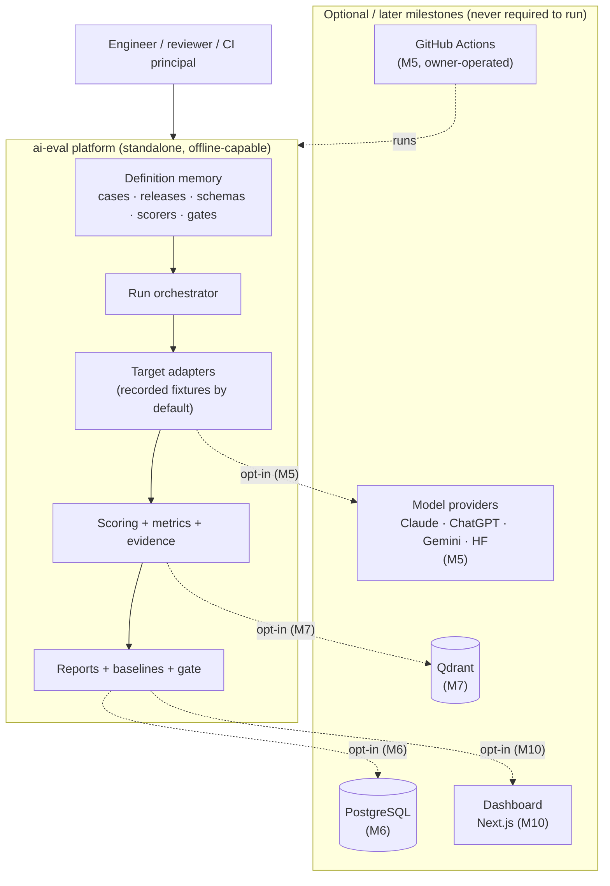
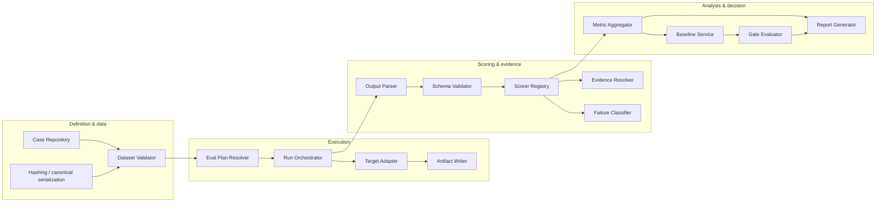
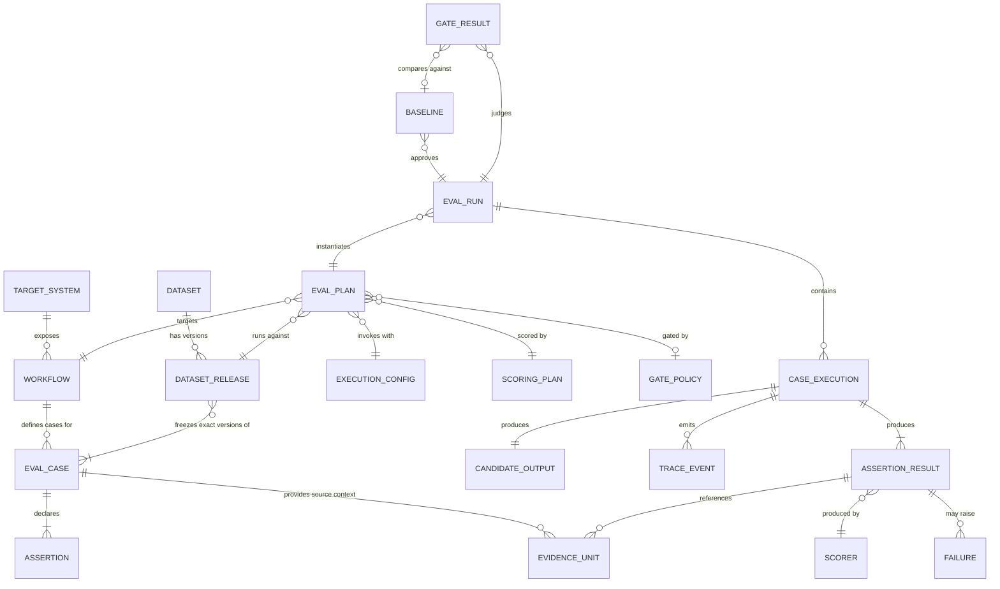
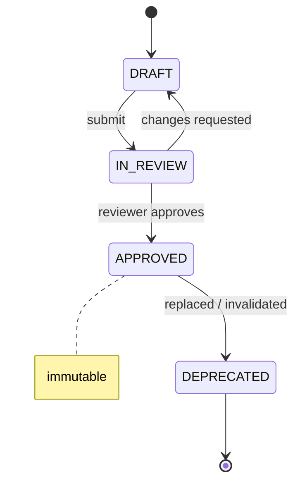
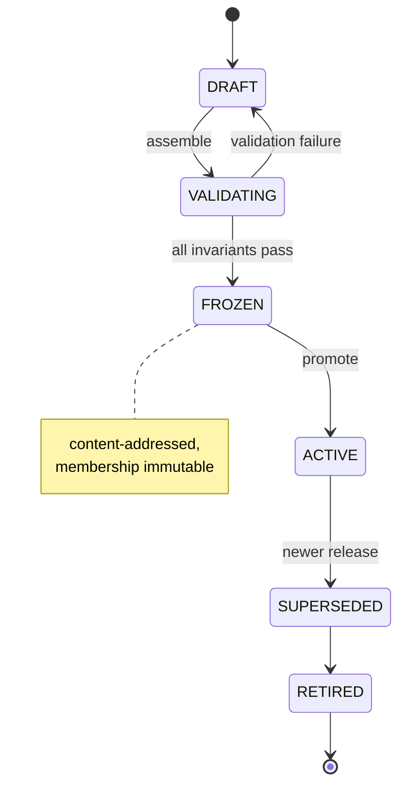
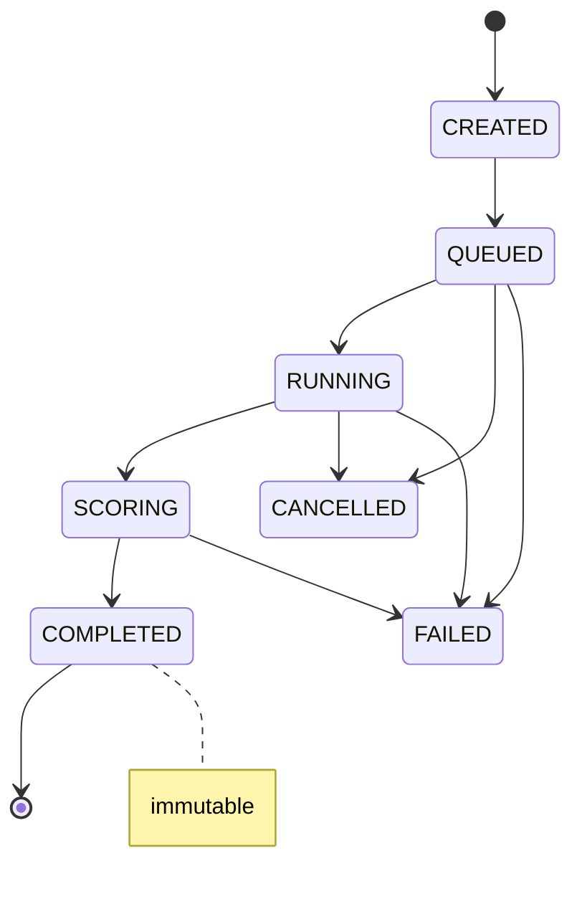
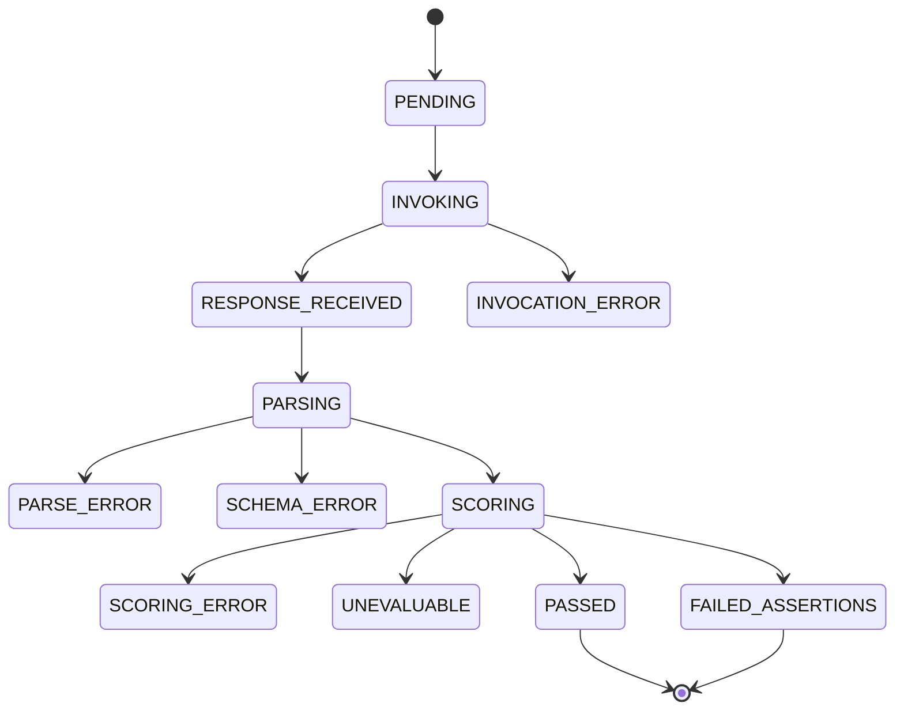
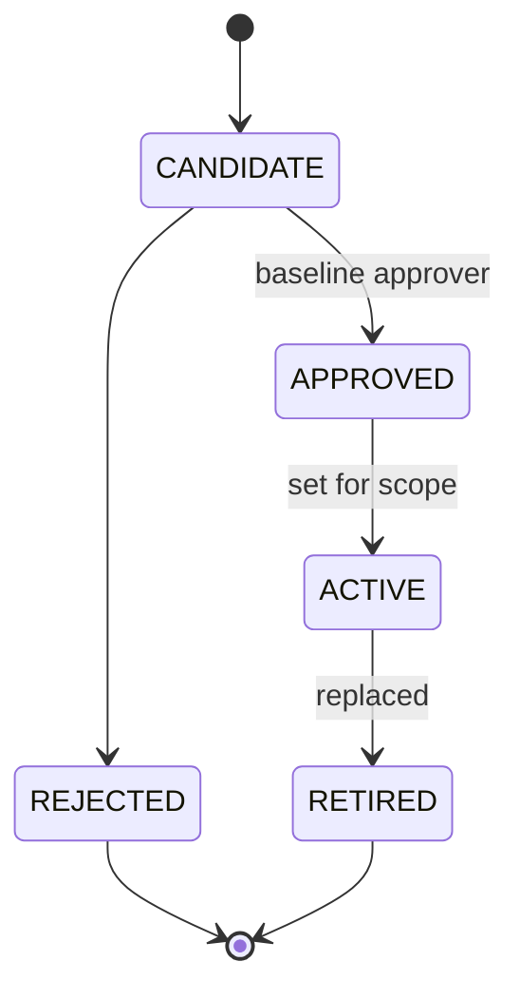
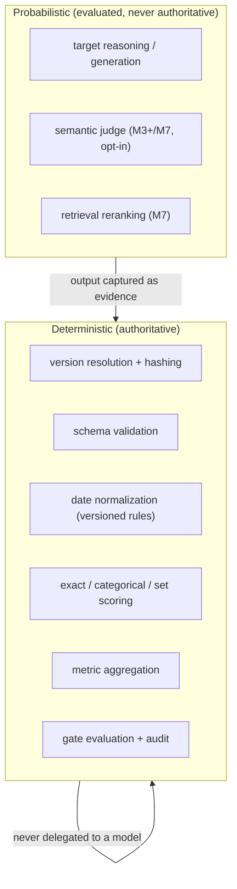

# Architecture

This document is the visual backbone of the platform. It shows how the pieces fit together,
how a single evaluation flows from a case to a gate decision, how the domain entities relate,
and how each object moves through its lifecycle. Every other doc links back here.

> If you read only one diagram, read [The evaluation pipeline](#2-the-evaluation-pipeline). It
> is the spine of the whole system: a case goes in, evidence and a gate decision come out, and
> nothing in between is allowed to hide a failure.

---

## 1. System context — what sits inside the boundary

The platform is a **self-contained evaluation harness**. It ships with its own datasets,
targets, scorers, and reports, and runs end-to-end from a clean checkout with no external
service. Optional integrations (model providers, a database, a vector store, a dashboard) attach
at the edges in later milestones but are never prerequisites.



**Reading it:** the solid path (top box) is everything the first checkpoint needs. The dashed
edges are opt-in and additive — remove them all and the platform still validates datasets, runs
evaluations, scores, reports, compares, and gates.

---

## 2. The evaluation pipeline

One case, from definition to gate decision. This is the control flow the run orchestrator
drives. The single most important rule is visible here: **raw output is captured before any
parsing**, so an invalid response can never be silently repaired into a passing score.

```mermaid
sequenceDiagram
    autonumber
    participant CLI as CLI / caller
    participant RES as Plan Resolver
    participant ORCH as Orchestrator
    participant TGT as Target Adapter
    participant ART as Artifact Store
    participant PAR as Parser + Schema Validator
    participant SC as Scorer Registry
    participant AGG as Metric Aggregator
    participant CMP as Baseline Comparator
    participant GATE as Gate Evaluator

    CLI->>RES: eval plan (workflow, dataset release, target, scoring plan, gate)
    RES->>RES: resolve every ref to an immutable version + hash
    RES-->>ORCH: run manifest (no floating references)
    loop each case in the frozen release
        ORCH->>TGT: invoke(case_input, context)
        TGT-->>ORCH: raw output + trace + usage + latency + errors
        ORCH->>ART: persist RAW (before parsing)
        ORCH->>PAR: parse + validate against output schema
        PAR-->>ORCH: parsed value OR explicit parse/schema failure
        ORCH->>SC: score each atomic assertion
        SC-->>ORCH: assertion results (+ evidence, + failure codes)
    end
    ORCH->>AGG: aggregate metrics (with denominators)
    AGG-->>ORCH: metric summary
    ORCH->>CMP: compare to approved baseline (optional)
    ORCH->>GATE: evaluate deterministic gate
    GATE-->>CLI: PASS / FAIL / INVALID (+ per-rule evidence, + exit code)
```

**Reading it:** steps 5–6 (raw capture) always precede step 7 (parsing). Every assertion
produces a result (step 9) — none are silently dropped. The gate (step 14) is deterministic and
returns per-rule evidence, not just a verdict.

---

## 3. Component architecture

The engineering components and the one-directional dependency flow between them. Each component
has a single responsibility and an explicit "must not own" boundary (see
[engineering-ontology.md](engineering-ontology.md)). Deterministic components are never renamed
"agents."



**Directory mapping:** `datasets/` (CR, DV) · `domain/` (HASH, models) · `execution/` (EPR, RO)
· `targets/` (TA) · `artifacts/` (AW) · `parsing/` (OP, SV) · `scoring/` (SR) · `evidence/`
(ER) · `failures/` (FC) · `metrics/` (MA) · `reporting/` (RG) · `baselines/` (BS) · `gates/`
(GE) · `cli/` (entrypoints).

---

## 4. Entity-relationship map

How the canonical business entities connect. A **Target System** exposes **Workflows**; a
**Workflow** owns **Eval Cases**; approved cases are frozen into a **Dataset Release**; a
release plus an execution configuration and scoring plan form an **Eval Plan**; running a plan
produces an **Eval Run** of many **Case Executions**, each yielding **Assertion Results** backed
by **Evidence**. See [business-ontology.md](business-ontology.md) for the full narrative.



---

## 5. Lifecycle state machines

Every versioned object has an explicit lifecycle. Immutability points are where a version can no
longer change — corrections create a **new** version instead of mutating the old one.

**Eval Case** — an approved version is immutable; a correction is a new `case_version`.



**Dataset Release** — only FROZEN/ACTIVE releases can back a publishable run.



**Eval Run** — a completed run is immutable and fully reproducible from its manifest.



**Case Execution** — the fine-grained path; note the distinct error terminals.



**Baseline** — approval is explicit; the highest score does not auto-promote.



---

## 6. Deterministic vs agentic zones

The platform keeps authority deterministic and confines probabilistic behavior to the *target
under test* and a few explicitly justified evaluator steps (added later). See
[deterministic-agentic-boundary.md](deterministic-agentic-boundary.md).



---

## 7. Storage & memory layout (first checkpoint)

All local files — no database in M0–M4. Each memory class (see
[memory-model.md](memory-model.md)) maps to a concrete location.

```mermaid
flowchart LR
    subgraph A["A. Immutable definition"]
        s1["schemas/*.json"]
        s2["datasets/reference/.../cases.jsonl + manifest.json"]
        s3["configs/gates/*.json"]
    end
    subgraph C["C. Evidence (append-only)"]
        r1["runs/&lt;run_id&gt;/raw/*"]
        r2["runs/&lt;run_id&gt;/traces.jsonl"]
        r3["runs/&lt;run_id&gt;/assertion_results.jsonl"]
    end
    subgraph D["D. Analytical (regenerable)"]
        m1["runs/&lt;run_id&gt;/metric_summary.json/.csv"]
        m2["runs/&lt;run_id&gt;/failure_report.md"]
        m3["runs/&lt;run_id&gt;/comparison_report.md"]
        m4["runs/&lt;run_id&gt;/gate_result.json"]
    end
    A --> C --> D
```



---

## 8. Where to go next

- **The domain in depth:** [business-ontology.md](business-ontology.md)
- **The engineering components:** [engineering-ontology.md](engineering-ontology.md)
- **The first workflow's contract + worked example:** [workflow-contracts/reference-request-triage-v1.md](workflow-contracts/reference-request-triage-v1.md)
- **What is and isn't in scope:** [system-boundary.md](system-boundary.md)
- **Technology and why each dependency exists:** [technology-map.md](technology-map.md)
