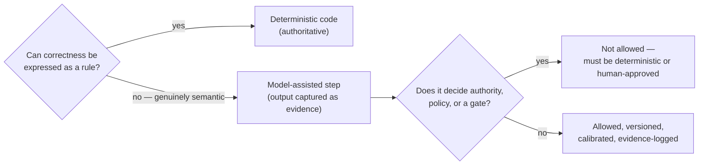

# Deterministic vs Agentic Boundary

The single most common way an "AI platform" loses its integrity is by letting a probabilistic
model creep into a place where a rule belongs — letting a model decide whether a permission
exists, whether a date matches, whether a run passed. This document draws the line and explains
*why* it sits where it does.

## The rule

> Use probabilistic models **only** for work whose value comes from contextual interpretation,
> synthesis, ranking, drafting, or semantic comparison. Keep authority, policy, state
> transitions, permissions, audit, validation, evidence integrity, and execution gating
> **deterministic.**

The test is simple: *if the answer can be expressed as a rule, it must be a rule.* A model is
allowed only where the requirement is genuinely semantic and no deterministic method is adequate —
and even then the model's output is **evidence, never authority.**

## Three tiers of responsibility

### Deterministic (authoritative)

IDs and version resolution; content hashes; dataset membership; schema validation; reference
integrity; case/release/run state transitions; manifest resolution; request construction;
timeout/retry classification; raw evidence capture; date normalization under declared rules;
exact and normalized comparisons; set metrics; numeric tolerance; policy lookup/oracle where
codified; permission and approval checks; tool allowlists and argument validation; score
aggregation; baseline compatibility; gate evaluation; audit events; Qdrant corpus/index version
mapping; report serialization.

### Agentic / model-assisted (evaluated, never authoritative)

Target-system reasoning and generation; summarization; extracting semantically expressed tasks;
drafting synthetic eval cases; proposing assertion candidates; semantic-equivalence scoring where
deterministic methods are inadequate; failure-cluster suggestions; report-narrative drafting;
retrieval reranking when explicitly evaluated; policy *explanation* (never policy *authority*).

### Human-only / human-approved

Approving expected outcomes; resolving ambiguous labels; approving dataset releases; calibrating
semantic judges; approving baselines; overriding gates; changing high-stakes policy snapshots;
authorizing production execution.

## Decision table

| Capability | Deterministic | Model-assisted | Human approval |
|---|:---:|:---:|:---:|
| JSON / schema validation | ✅ | — | — |
| Deadline normalization | ✅ | — | only ambiguous source cases |
| Risk extraction *by the target* | — | ✅ | — (gold label creation: yes) |
| Risk score *comparison* | ✅ | — | — |
| Missing-info equivalence | prefer aliases first | optional judge | judge calibration |
| Evidence support | source-reference checks | optional nuanced judge | edge cases |
| Policy outcome oracle | ✅ if codified | — | policy approval |
| Agent recommendation | — | ✅ | depends on downstream action |
| Tool execution gate | ✅ | — | approval where policy requires |
| Dataset case drafting | validation only | ✅ | ✅ before approval |
| Baseline promotion | rules support | narrative help | ✅ |
| CI gate | ✅ | — | override only |

Read the table as: the *target* may be probabilistic (that is the thing under test), but every
column that decides whether the target *passed* is deterministic or human-approved.

## The no-fake-agent rule

Do **not** create separate "agents" for loading data, validating JSON, computing metrics, writing
files, or checking thresholds. Those are deterministic components or typed skills. Renaming a
validator or a database call an "agent" is exactly the kind of drift this platform exists to
prevent.

> An agent boundary is justified **only** when a component must choose among multiple valid
> skills/actions using incomplete context **and its choice is itself evaluated** — and it emits an
> inspectable trace of that choice.

That situation first appears in the governed-tool-use workload (M8), where "which skill did the
target select, and was that the right call?" is a genuine evaluated decision. Everywhere in the
first slice, there is no agent — only deterministic components and one probabilistic target.

## In the first slice (M0–M4)

Everything is deterministic. The only probabilistic element is the *target under test*, and the
harness never modifies the target's response before evidence capture. No LLM judge is used at all
— grounding is measured with deterministic evidence checks, not a model's opinion. The rationale
is in [adr/0003](adr/0003-no-llm-judge-in-first-slice.md).
