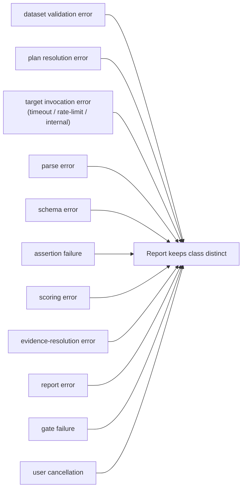

# Engineering Ontology

Where [business-ontology.md](business-ontology.md) defines the *domain*, this defines the
*machinery*: the software components, what each one is uniquely responsible for, and — just as
important — what each one is forbidden from owning. The "must not own" column is not bureaucracy;
it is what keeps target invocation separate from scoring, parsing separate from correctness, and
integration transport separate from domain policy. Those separations are the reason a failure can
always be attributed to the right layer.

## Principles

1. **Domain contracts are independent from provider SDKs.** The `domain/` models never import
   `anthropic` or `qdrant_client`. Providers live behind adapters.
2. **Target invocation is separate from scoring.** The thing that calls the target does not judge
   the target. Otherwise a bug in invocation hides as a quality result.
3. **Parsing failure is separate from assertion failure.** Malformed JSON is a contract problem,
   not a wrong answer. They are counted differently and fixed differently.
4. **Retrieval evaluation is separate from generation evaluation** (M7). "The answer was wrong"
   must distinguish "we retrieved the wrong context" from "we had the right context and still got
   it wrong."
5. **Raw evidence is retained before transformation.** Always. See
   [adr/0002](adr/0002-raw-evidence-before-parsing.md).
6. **Every derived result records its producer and version.** A metric or score you cannot trace
   to the exact scorer that made it is not evidence.
7. **Integration adapters do not own domain policy.** A provider adapter maps transport; it never
   decides what "correct" means.
8. **Run orchestration does not interpret business correctness.** The orchestrator sequences
   steps; scorers decide right and wrong.
9. **UI and API layers consume stable application contracts** — they never recompute authoritative
   metrics.
10. **Async infrastructure is added only when synchronous execution is an actual constraint** —
    not preemptively.

## Components and their boundaries

The dependency flow between these is drawn in
[architecture.md §3](architecture.md#3-component-architecture).

| Component | Single responsibility | Must **not** own |
|---|---|---|
| **Case Repository** | Load/persist case versions and dataset releases. | Target execution or scoring. |
| **Dataset Validator** | Validate schemas, references, hashes, review state, release invariants. | Creating labels. |
| **Eval Plan Resolver** | Resolve every reference to an immutable version + hash → run manifest. | Provider calls. |
| **Run Orchestrator** | Sequence execution, parsing, scoring, aggregation, reporting. | Workflow-specific score semantics. |
| **Target Adapter** | Invoke one target workflow under a typed contract; capture raw output/trace/usage. | Aggregation or gate decisions. |
| **Provider Adapter** (M5) | Translate provider-neutral invocation to a specific provider API. | Business workflow semantics. |
| **Prompt Renderer** (M5) | Render a versioned prompt spec from case inputs. | Transport or scoring. |
| **Output Parser** | Convert raw output into a candidate structured value. | Silent correctness repair. |
| **Schema Validator** | Validate candidate data against a versioned schema. | Semantic scoring. |
| **Scorer** | Evaluate one assertion type into evidence-backed results. | Orchestration. |
| **Judge Adapter** (later) | Invoke a configured semantic judge and validate its output. | High-stakes gate authority. |
| **Evidence Resolver** | Resolve source spans, chunks, trace references; validate bounds. | Changing canonical source content. |
| **Metric Aggregator** | Compute named aggregates from assertion/operational observations. | Mutating case labels. |
| **Failure Classifier** | Map explicit conditions to controlled taxonomy codes. | Hiding unknown failures in a generic bucket. |
| **Baseline Service** | Manage candidate/approved/active baselines. | Editing completed runs. |
| **Gate Evaluator** | Execute deterministic threshold and critical-case rules. | Inventing metrics ad hoc. |
| **Report Generator** | Render run data into machine and human reports. | Becoming the system of record. |
| **Result Store** | Persist immutable run evidence and derived results. | Provider credentials or policy. |

**A deterministic component is never renamed an "agent."** Loading data, validating JSON,
computing a metric, or checking a threshold are components — see
[deterministic-agentic-boundary.md](deterministic-agentic-boundary.md).

## Distinct error classes

A core design goal is that the *kind* of failure survives all the way into the report. These
classes are never collapsed into a generic "error":



The two distinctions that matter most:

- **A target invocation error is not a low-quality answer.** If the provider timed out, that is
  an operational fact counted under error metrics with its own denominator — it does not drag down
  a quality score as if the model gave a bad answer.
- **A schema error is not a semantic failure.** Malformed or schema-invalid output produces a
  contract failure; the downstream output assertions become `unevaluable` (counted per each
  assertion's declared policy), not silently "wrong."

Full code list: [failure-taxonomy.md](failure-taxonomy.md).

## Package layout (`src/ai_eval/`)

Directories are created only as a milestone actually needs them — no empty scaffolding.

```
domain/       # Pydantic models, enums, state machines, canonical hashing        (M1)
datasets/     # case loader (JSONL), dataset validator, release freezer          (M1)
execution/    # eval-plan resolver, run orchestrator                             (M2)
targets/      # TargetAdapter base + recorded fixtures (M2); providers/ (M5)
artifacts/    # per-run artifact writer, raw-before-parse capture                (M2)
parsing/      # strict parser + schema validator                                 (M3)
scoring/      # versioned scorers, registry, deadline normalizer                 (M3)
evidence/     # evidence resolver (span/bounds validation)                       (M3)
metrics/      # metric aggregator (numerator/denominator/missing-data)           (M3)
failures/     # failure classifier → taxonomy codes                              (M3)
reporting/    # JSONL / JSON / CSV / Markdown generators                         (M3)
baselines/    # baseline manifest + comparison                                   (M4)
gates/        # deterministic gate evaluator                                     (M4)
cli/          # Typer app: dataset / run / compare / gate / demo                 (M4)
# later: retrieval/ (M7) · agent_evaluation/ (M8) · ml/ (M9) · api/ + workers/ (M6)
```

## How the layers reuse each other

The later layers (API, workers, dashboard) are **consumers** of the same domain contracts, not
reimplementations. A FastAPI endpoint (M6) resolves and runs the *same* eval plan the CLI does;
the dashboard (M10) renders the *same* metric summary the reporting layer produced. There is one
definition of "an eval run," and everything above the domain layer speaks it. This is what stops
the platform from growing a second, divergent ontology per interface.
