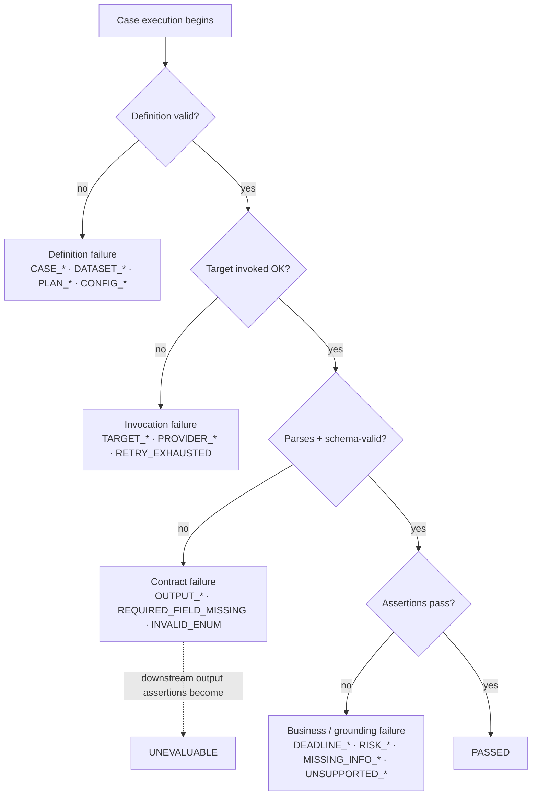

# Failure Taxonomy

A failure is only useful if you know *what kind* it is. "The eval failed" could mean the provider
timed out, the JSON was malformed, the risk label was wrong, or the scorer itself crashed — four
completely different problems with four different owners and fixes. This taxonomy gives every
failure a controlled code, groups the codes by class, and — critically — keeps the classes
distinct all the way into the report. Unknown failures are **never** hidden in a generic bucket.

## Where each class arises

## Codes by class

### Definition failures
`CASE_SCHEMA_INVALID` · `CASE_REFERENCE_INVALID` · `CASE_UNAPPROVED` · `DATASET_HASH_MISMATCH` ·
`ASSERTION_INVALID` · `PLAN_REFERENCE_UNRESOLVED` · `CONFIG_INCOMPATIBLE`
*Owner: Eval Author / Reliability Maintainer. Caught before a run even starts.*

### Invocation failures
`TARGET_UNAVAILABLE` · `PROVIDER_AUTH_ERROR` · `PROVIDER_RATE_LIMIT` · `PROVIDER_TIMEOUT` ·
`TARGET_INTERNAL_ERROR` · `RETRY_EXHAUSTED`
*Owner: operations. **Not** a quality problem — counted separately (see below).*

### Contract failures
`OUTPUT_EMPTY` · `OUTPUT_PARSE_ERROR` · `OUTPUT_SCHEMA_INVALID` · `REQUIRED_FIELD_MISSING` ·
`INVALID_ENUM` · `INVALID_EVIDENCE_REFERENCE`
*Owner: the target's output layer. The output didn't honor the contract.*

### Business assertion failures
`DEADLINE_MISSED` · `DEADLINE_FALSE_POSITIVE` · `DEADLINE_FALSE_NEGATIVE` ·
`RISK_UNDERCLASSIFIED` · `RISK_OVERCLASSIFIED` · `MISSING_INFO_OMITTED` ·
`MISSING_INFO_SPURIOUS` · `NEEDS_ATTENTION_INCORRECT` · `TASK_UNSUPPORTED`
*Owner: the target's reasoning. The output was well-formed but wrong.*

### Grounding failures
`UNSUPPORTED_MATERIAL_CLAIM` · `SOURCE_CONTRADICTION` · `EVIDENCE_NOT_FOUND` ·
`EVIDENCE_MISMATCH` · `EVIDENCE_COVERAGE_LOW`
*The output made a material claim the sources don't support.*

### Retrieval failures (M7)
`RELEVANT_CHUNK_NOT_RETRIEVED` · `IRRELEVANT_CONTEXT_DOMINATES` · `WRONG_CORPUS_VERSION` ·
`STALE_VECTOR_INDEX` · `FILTER_MISMATCH` · `DUPLICATE_CHUNK_RETRIEVED`

### Agent / policy failures (M8)
`WRONG_SKILL_SELECTED` · `POLICY_OUTCOME_INCORRECT` · `ESCALATION_MISSED` ·
`APPROVAL_REQUIREMENT_MISSED` · `PROHIBITED_TOOL_PROPOSED` · `TOOL_ARGUMENT_INVALID` ·
`EXECUTION_BEFORE_APPROVAL` · `UNAVAILABLE_PERMISSION_ASSERTED` · `TRACE_ORDER_INVALID`

### Evaluator failures
`SCORER_ERROR` · `JUDGE_ERROR` · `JUDGE_OUTPUT_INVALID` · `EVIDENCE_RESOLUTION_ERROR` ·
`METRIC_AGGREGATION_ERROR` · `REPORT_GENERATION_ERROR`
*The evaluator itself broke — this is a bug in the harness, not the target, and must never be
scored as a target failure.*

## Severity

| Severity | Meaning | Gate effect |
|---|---|---|
| **critical** | safety, policy, permission, or materially harmful behavior | blocks the gate |
| **major** | wrong core business outcome (deadline, risk, required missing info) | counts against quality floors |
| **minor** | quality defect not changing the core outcome | reported, usually non-blocking |
| **informational** | observation or non-blocking drift | recorded only |

## Counting rules — why this matters for honesty

The taxonomy is not just labels; it decides how a failure is *counted*, and honest counting is
it determines whether a metric is honest.

- **Invocation failures are excluded from quality-metric numerators.** If a provider times out on
  3 of 30 cases, high-risk recall is computed over the *evaluable* cases with an explicit
  denominator, and the 3 timeouts are reported under operational/error metrics. A timeout is not
  a wrong answer, and burying it in a quality score would flatter or punish the model dishonestly.
- **Contract failures make downstream assertions `unevaluable`, not `fail`.** A schema-invalid
  output yields one `OUTPUT_SCHEMA_INVALID` contract failure; the `risk`/`deadline`/`missing_info`
  assertions that needed a parsed value are recorded as `unevaluable` per each assertion's
  `on_unevaluable` policy — not silently marked wrong.
- **Every metric declares numerator, denominator, and missing-data behavior.** There is no such
  thing as a bare "0.9" here.
- **Evaluator failures are quarantined.** A `SCORER_ERROR` is a harness bug; it never counts as a
  target quality failure. It surfaces loudly so the harness itself gets fixed.

How codes feed the gate is defined by [../schemas/gate_policy.v1.json](../schemas/gate_policy.v1.json).

## Codes exercised in the first slice (M0–M4)

Definition, invocation (recorded targets only emit `TARGET_INTERNAL_ERROR`-style fixtures),
contract, business assertion, grounding, and evaluator codes. Retrieval and agent/policy codes
are reserved for M7/M8. The seeded-regression demo deliberately triggers `MISSING_INFO_OMITTED`,
`DEADLINE_*`, `RISK_UNDERCLASSIFIED`, `OUTPUT_SCHEMA_INVALID`, and `INVALID_EVIDENCE_REFERENCE`
to prove each is caught and correctly classified.
