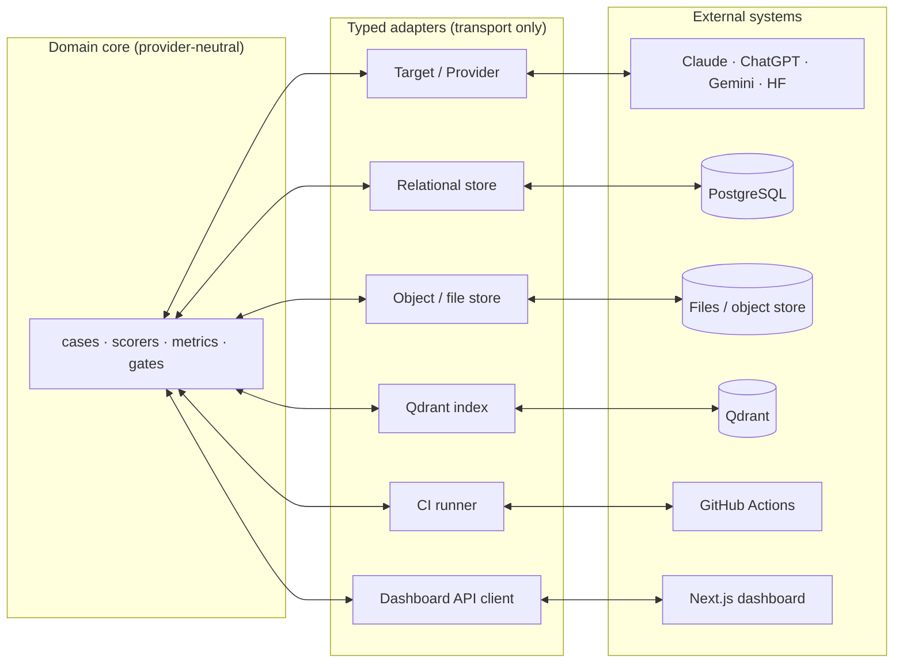

# Integration Boundaries

Every external system the platform touches — a model provider, a database, a vector store, CI, a
dashboard — is reached through a **typed adapter.** The adapter translates transport (auth,
request shape, error codes, pagination) and nothing else. It never decides what "correct" means,
never owns an expected value, never defines a metric. This is what lets the platform swap Claude
for Gemini, or files for PostgreSQL, without a single scorer changing.

## Target system

- **In:** workflow ID/version, rendered request, context bundle, execution config, trace context.
- **Out:** raw output, optional parsed-native output, trace events, usage, latency, error
  envelope, target request ID.
- **Boundary:** the target adapter **does not score correctness.** It returns what happened; the
  scorers judge it.

## Model provider (M5)

Provider adapters exist for **Claude (Anthropic), ChatGPT (OpenAI), Gemini (Google), and local
HuggingFace models** behind one interface.

| Provider adapters own | Provider adapters do **not** own |
|---|---|
| auth transport | business prompts |
| request formatting | expected outputs |
| structured-output mode translation | metric definitions |
| token/usage extraction | retrying *semantic* failures |
| provider error mapping | cost truth without a price-table reference |
| provider request IDs, model-revision metadata | |

The point of one interface is fair comparison: the same dataset, prompt spec, schema, scorer set,
and report contract must work across every provider, so a comparison measures the *model*, not an
accident of adapter behavior.

## Relational store (M6)

The system of record for structured metadata and run relationships once persistence exists:
identifiers/versions, manifests/hashes, states, references to large artifacts, assertion results,
metrics, review/audit records, baseline/gate relationships. Large raw documents/responses live in
object storage with content-addressed references. **First checkpoint uses the local filesystem —
no database.**

## Object / file store

Stores source documents, raw provider payloads, generated reports, large trace artifacts, model
artifacts, corpus snapshots. The interface supports content-hash verification. In the first slice
this is plain files under `runs/<run_id>/`.

## Qdrant (M7)

| Qdrant adapter owns | Qdrant does **not** own |
|---|---|
| collection/alias creation | canonical text |
| vector upsert & search | document lifecycle |
| filter translation | eval labels |
| index health/count checks | result aggregation |
| deletion by corpus/index version | authorization policy |

Every point payload references `chunk_id`, `document_version_id`, `corpus_version_id`,
`chunk_hash`, `embedding_config_id`, and filter dimensions. Qdrant is a **derived index** —
[adr/0004](adr/0004-qdrant-is-derived-index.md).

## CI (M5) — operated by the repository owner

CI receives: repo revision, eval-plan reference, minimum-scope credentials, optional changed-file
context. CI produces: run reference, gate result, machine report, human summary, artifact links.
CI may block merge/deploy on a deterministic gate result; it may **not** approve overrides.
**GitHub Actions execution (workflows, secrets, runs) is operated by the repository owner, not by
the harness** — the platform writes the workflow files and defines the gate; the owner runs them.

## Identity, secrets, observability

Identities and roles come from an external identity boundary. Secrets load at execution time from
env/secret manager and are **never** stored in run manifests or reports. Operational logs/traces
may be exported, but the evaluation evidence ledger remains authoritative for eval semantics — a
metric on a dashboard or in a log is a copy, not the source of truth.

## Data export

Every export includes: schema version, run/plan IDs, content hashes, sensitivity/redaction
metadata, generated-at timestamp, and producer version — so an exported artifact can always be
traced back to the exact run and code that produced it.
