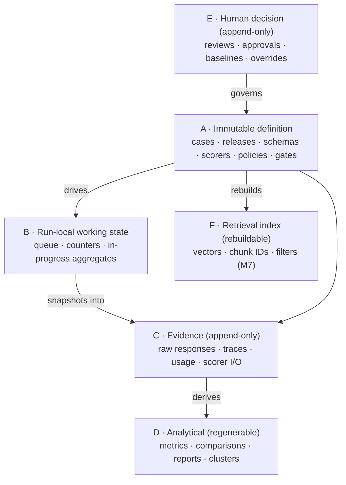

# Memory Model

"The agent remembers things" is where a lot of AI systems go to die. Hidden conversational
history leaks into results, nobody can say what influenced an output, and "state" becomes an
untraceable blob. This platform has **no mystical agent memory.** It has six explicit state
classes, each with a defined owner, write mode, retention rule, and authority. If a piece of
state does not fit one of these classes, it does not belong in the system.

## The six classes

| Class | Contains | Write rule | Authority |
|---|---|---|---|
| **A. Immutable definition** | approved case versions, dataset releases, schemas, prompt/scorer specs, policies, gates, corpus/chunk versions | append-only new versions; content-addressed; **no in-place mutation after approval/freeze** | authors/maintainers write drafts; reviewers approve |
| **B. Run-local working state** | queued case IDs, current case state, temp request/response handles, retry counters, in-progress aggregates | mutable **only during** a run; final state snapshotted into C | orchestrator/worker; not business truth |
| **C. Evidence** | raw requests/responses, trace events, provider IDs, source spans, retrieved chunk IDs, usage/latency, parser outputs, scorer inputs/outputs | **append-only after capture**; transformations keep links to originals | target adapters + scorers; access-controlled |
| **D. Analytical** | aggregate metrics, comparisons, failure clusters, reports, trends | append-only/versioned; records producer + version; **never silently overwrites** prior analysis | aggregators/reporters; always regenerable from A + C |
| **E. Human decision** | reviews, adjudications, approvals, baseline decisions, gate overrides, rationales | append-only; supersession explicit; **overrides never erase** the original outcome | authorized humans only; actor + authority recorded |
| **F. Retrieval index** (M7) | vectors, chunk IDs, filter metadata, embedding/config refs | replace by version/alias | derived and rebuildable; **Qdrant is not canonical storage** |

## Why the classes are separated

- **A vs C.** Definition memory is the *question* ("here is the approved expected answer");
  evidence memory is the *observed reality* ("here is exactly what the target returned"). Mixing
  them lets a bad output quietly rewrite the standard it was measured against.
- **C vs D.** Evidence is the raw record; analytics are *derived* from it. Because D is always
  regenerable from A + C, a report can be rebuilt from scratch and must match — which is the
  guarantee behind "a completed run is reproducible."
- **E is append-only.** A gate override does not delete the failing gate result; it sits *beside*
  it with an actor, a rationale, and a scope. The history of "who decided what, and why" is never
  rewritten.
- **F is disposable.** The vector index is a performance structure, not truth. It can always be
  rebuilt from canonical documents; a stale or mixed-version index is *invalid*, not merely
  suboptimal.

## Context assembly

Any model-assisted step (a target call, or later a judge) receives a **declared context bundle**
that records: source references; exact rendered content or content hashes; ordering; truncation;
token counts; retrieval config; prompt spec; redactions. This is what makes a probabilistic step
reproducible-enough to reason about.

> **Hard rule:** hidden chat history must not influence a publishable run unless it is captured as
> an explicit, versioned input artifact. If it wasn't written down as an input, it didn't happen.

## Retention & sensitivity

The model supports sensitivity classification; field- or artifact-level redaction; secrets
exclusion (secrets never enter A, C, or D); configurable retention for raw provider payloads;
irreversible deletion only where legally required, with tombstone audit records; and synthetic,
public-safe datasets for demos.

## In the first slice (M0–M4)

Only four classes are exercised, all on the local filesystem, no database:

- **A** — `schemas/`, `datasets/reference/request_triage/v1/`, `configs/gates/`.
- **B** — in-process Python state during a run.
- **C** — `runs/<run_id>/raw/`, `traces.jsonl`, `assertion_results.jsonl`.
- **D** — `runs/<run_id>/metric_summary.{json,csv}`, `failure_report.md`,
  `comparison_report.md`, `gate_result.json`.

Classes **E** (human-decision persistence) and **F** (retrieval index) arrive with persistence
(M6) and RAG (M7). The mapping to concrete files is drawn in
[architecture.md §7](architecture.md#7-storage--memory-layout-first-checkpoint).
