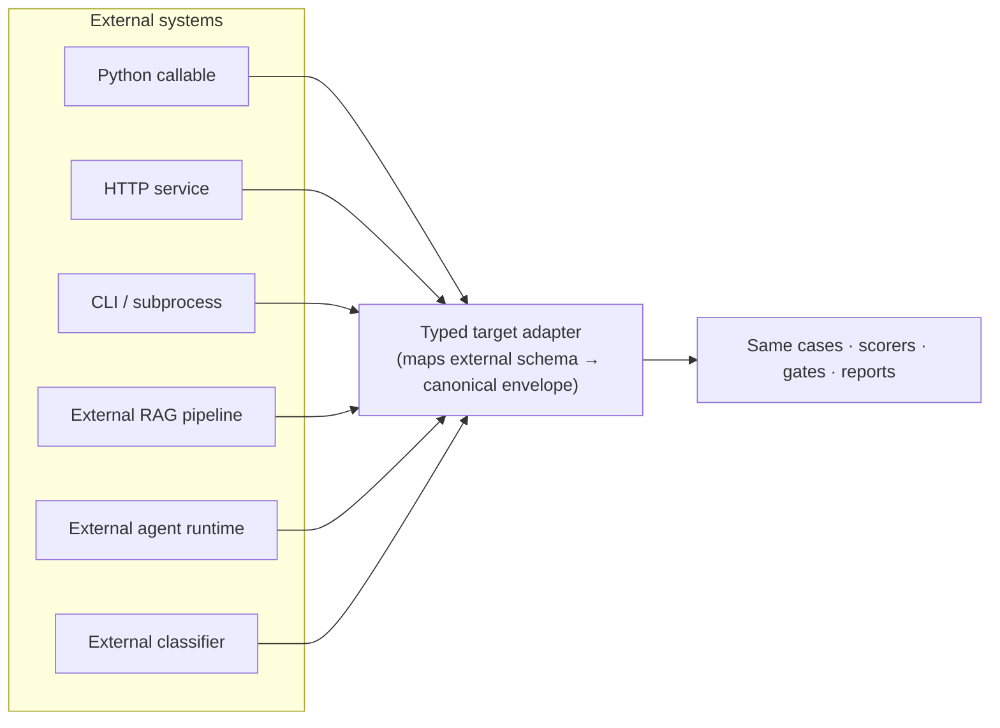

# External Target Adapters (final integration phase)

**Status:** ⬜ Planned. Attempted **only after** all standalone workloads (M0–M9) pass. External
targets are integrations, never foundations.

## Goal

Let the platform evaluate AI systems that live *outside* this repository — a colleague's HTTP
service, a CLI tool, an external RAG pipeline or agent runtime — by mapping them into the same
canonical target contract everything else already uses.

## Principle

> An external target **reuses** the platform's ontology, datasets, scorers, evidence model,
> baselines, gates, and reports. It never provides them, and it never forks them for one
> integration.

## Adapter types

`PythonCallable` · `HTTP` · `CLI/subprocess` · `Provider` · `RAGPipeline` · `AgentRuntime` ·
`Classifier`. Each satisfies the same `TargetAdapter.invoke(...) -> TargetInvocationResult`
contract and returns raw output, trace, usage, latency, and an error envelope.

## Deliverables

Adapters mapping external schemas into the canonical envelope; contract tests per adapter;
data-sensitivity rules for external content; recorded-response fixtures so external targets can be
tested offline.

## Exit criteria

External targets can be added **without changing** core ontology, scorers, or gates; the platform
remains fully usable when no external adapter is configured.
