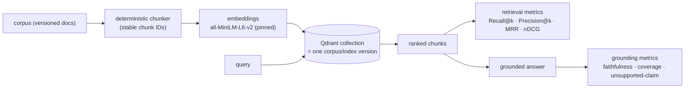

# Phase 7 (M7) — RAG & Qdrant

**Status:** ⬜ Planned. Not started. Introduces the second reference workload,
`reference.grounded_qa.v1`.

## Goal

Evaluate a retrieval-augmented workflow end to end, and — the whole point — **separate retrieval
quality from generation quality** so a wrong answer can be attributed to the right stage.

## Why a vector store is justified here (and only here)

Qdrant appears exactly when there is a retrieval-dependent workload to evaluate, never as a resume
keyword. It is a **derived index** ([adr/0004](../adr/0004-qdrant-is-derived-index.md)): canonical
documents, chunks, labels, and results live in file/object/relational storage; Qdrant holds only
vectors + payload references and is fully rebuildable.

## The pipeline

## Deliverables

- Canonical corpus/document/chunk models; deterministic chunking + IDs.
- **sentence-transformers** embeddings, default `all-MiniLM-L6-v2` with **exact revision +
  dimension recorded**; optional **CrossEncoder** reranker as a separate versioned config.
- **Qdrant** via **Docker Compose**; **qdrant-client** adapter; recorded retrieval fixtures for
  offline tests.
- **pypdf** / **python-docx** ingestion.
- Retrieval metrics (Recall@k, Precision@k, MRR, nDCG, context precision/recall,
  empty-retrieval rate, duplicate-chunk rate) + grounded-answer metrics (faithfulness, answer
  relevancy, unsupported-claim rate, abstention correctness), via deterministic code plus
  **Ragas**/**DeepEval** adapters where the canonical definition stays ours.
- Retrieval/generation/infrastructure failure attribution.
- Mutation tests: wrong collection, stale index, mixed corpus versions, bad filter, duplicate
  chunk, top-k too low, embedding-revision drift, relevant-chunk-ignored, invented fact.

## Exit criteria

Index rebuildable from canonical sources; no mixed corpus versions; wrong/stale-index mutations
detected; retrieval vs answer quality reported separately; the built-in corpus demo runs locally
without any external application.

## New dependencies / downloads

`rag` group (`qdrant-client`, `sentence-transformers`, `pypdf`, `python-docx`, `ragas`,
`deepeval`). **HuggingFace model download** `sentence-transformers/all-MiniLM-L6-v2` (~90 MB,
pinned revision). Re-flagged to the owner before download.
