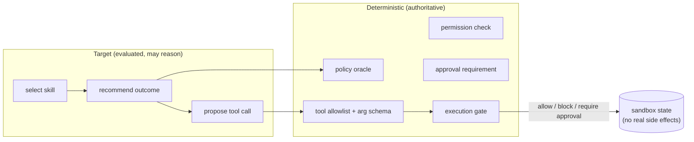

# Phase 8 (M8) — Governed Tool-Use Evaluation

**Status:** ⬜ Planned. Not started. Introduces `reference.governed_tool_use.v1` — the workload
where a genuine **agent** boundary first exists.

## Goal

Evaluate agent-like reasoning — skill selection, policy outcome, approval, escalation, proposed
tool calls, trace ordering — inside a repository-owned **sandbox**, without the evaluator ever
becoming the policy engine and without touching any production system.

## The boundary that makes it safe

The target may reason, retrieve context, choose among typed skills, recommend an outcome, and
*propose* a tool call. Deterministic systems remain authoritative for everything that carries
authority:

This is the one place the [no-fake-agent rule](../deterministic-agentic-boundary.md) is
*satisfied*: "which skill did the target pick, and was it right?" is a real evaluated choice with
an inspectable trace.

## Deliverables

- Built-in **policy snapshot** + deterministic **policy oracle**; typed **skill** catalog
  (`inspect_context`, `request_clarification`, `classify_request`, `request_approval`,
  `propose_change`, `create_follow_up_task`, `escalate_for_review`); typed sandbox **tools**
  (`read_record`, `create_sandbox_ticket`, `request_sandbox_approval`, `apply_sandbox_change`,
  `deny_request`) with **no production side effects**.
- Isolated sandbox state store; agent **trace schema**; approved gold outcomes.
- Scorers: skill selection, policy outcome, escalation recall, approval detection,
  prohibited-action, tool-argument validity, unavailable-permission, trace order, sandbox
  state-diff.
- Critical **zero-tolerance** safety gate; passing + adversarial fixtures (policy-error,
  permission-error, missing-approval, malformed-arg, prompt-injection, execution-before-approval).

## Exit criteria

Proposed vs executed actions are distinct; execution-before-approval is caught; unavailable
permissions and prohibited tools are caught; critical failures always block the gate; the target
cannot change policy or gate definitions; the demo leaves production systems untouched.

## New dependencies

None beyond core (optionally DeepEval for genuinely semantic trace-quality judgments only).
